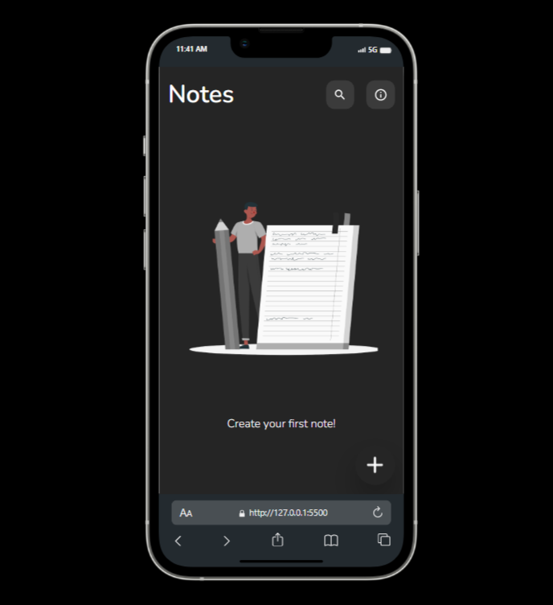

# Sticky-notes app
## Project Overview
This is a simple sticky notes app project that can be able to read created Sticky notes added as well as display them in an organized way.

## Tech Stack
The project is built with HTML for the markup and Tailwind CSS for the styling, No JavaScript.

## Screenshots
### Mobile View

### Tablet View

## Link
 - Live Site:[Live Site](https://devjhex-sticky-notes.netlify.app) 